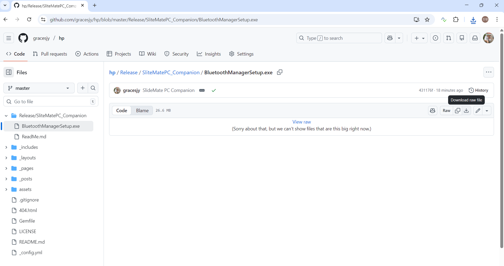

## SlideMate PC Companion
### Installation

Install BluetoothManager from the URL below on your PC.  
https://github.com/gracesjy/hp/tree/master/Release/SliteMatePC_Companion/BluetoothManagerSetup.exe

### Restrictions

Because Microsoft PowerPoint comes in so many different versions, it's difficult to cover all the previous versions. Current testing is on Windows 11, Office 365.

### About this app

1. Both the Android app and this companion rely on Bluetooth and ***do not leak data***.
2. This Companion SW does ***not contain any code that deletes data*** and ***does not create any files***.
3. This Companion SW installs three things: 1) Microsoft VC_redist.x64.exe, 2) PowerPoint AddInRaymond, and 3) BluetoothManager
4. Therefore, you can easily delete it cleanly by deleting it from the Windows Setup.

 

### Hoping for your understanding...

This is a personal app, and it's not perfect. Please understand that this is due to limitations in the PowerPoint and Windows APIs, as well as my own capabilities.
