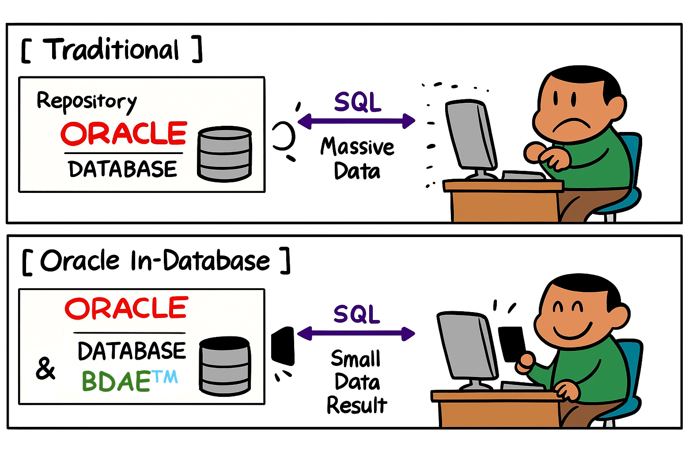
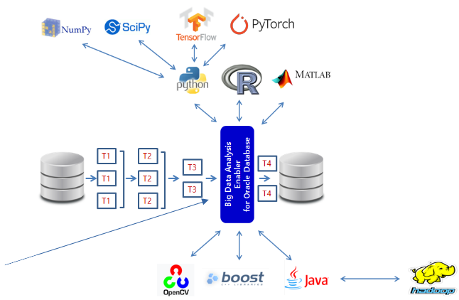

# BDAE(ie,)

Big Data Analysis Enabler(BDAE) enables parallel processing of Python and R without data movement based on Oracle In-Database.
Because it implements the Oracle Data Cartridge Interface, it is not limited to a specific schema and supports Dynamic SQL.

(contact : gracesjy@naver.com)






## How To run (3 Steps to Run !)
1. Register your python model in Oracle Database's table or PYTHONPATH directory.
2. Register the SQL to mix source data and your model.
3. Run the SQL and get the results.


## Step-1) Make Your Python module (ML/DL/ ...)

You must make entry function of module, for example describe().
others are helper functions. 

```mermaid
import numpy as np
import os
import matplotlib as mpl
import matplotlib.pyplot as plt
import pandas as pd
import tempfile
import base64
from pandas.plotting import scatter_matrix

def make_output(df, key, data):
   df[key] = data
   return df

def image_to_html():
   tmp_file_name = tempfile.NamedTemporaryFile().name + '.png'
   plt.savefig(tmp_file_name)
   image = open(tmp_file_name, 'rb')
   image_read = image.read()
   image_64_encode = base64.b64encode(image_read)
   uri = ''
   html_str = "<html><body>" + uri + "</body></html>"
   if os.path.exists(tmp_file_name):
      os.remove(tmp_file_name)
   return html_str

def describe(housing):
   # 0) Prepare Output
   tupleStart = {'subject': [ 'General ML' ] }
   pdf = pd.DataFrame(tupleStart)

   # 1) Historam
   housing.hist(bins=50, figsize=(20,15))
   a = image_to_html()
   pdf = make_output(pdf, 'Histogram', a)

   # 2) Scatter Plot
   housing.plot(kind="scatter", x="LONGITUDE", y="LATITUDE", alpha=0.4,
             s=housing["POPULATION"]/100, label="POPULATION", figsize=(10,7),
             c="MEDIAN_HOUSE_VALUE", cmap=plt.get_cmap("jet"), colorbar=True,
             sharex=False)
   plt.legend()
   a = image_to_html()
   pdf = make_output(pdf, 'ScatterPlot', a)

   # 3) Scatter Matrix
   attributes = ["MEDIAN_HOUSE_VALUE", "MEDIAN_INCOME", "TOTAL_ROOMS",
              "HOUSING_MEDIAN_AGE"]
   scatter_matrix(housing[attributes], figsize=(12, 8))
   a = image_to_html()
   pdf = make_output(pdf, 'ScatterMatrix', a)
   
   return pdf

```

## Step-2) Make Your SQL to run

The input (Oracle Database's Table or View or Queries) is delivered 
pandas DataFrame format to your python entry point function,
and You must make the results into pandas DataFrame format !,
because of Oracle Database Query Results(RDBMS).

```mermaid
SELECT * 
      FROM table(apTableEval(
         	cursor(select * from CAL_HOUSING),  -- Input Data (Driving Table)
         	NULL,  -- Secondary Input Data
            'SELECT CAST(''A'' AS VARCHAR2(40)) SUBJECT,  -- Output Format
                  TO_CLOB(NULL) H1, TO_CLOB(NULL) H2, TO_CLOB(NULL) H3 
             FROM DUAL',
           'CAL_HOUSING_EDM:describe'))  -- Python Module for calling
```

## Step-3) Run above SQL and get Results
Like General SQL Queries' results, BDAE's results are the same.
(Any Applications you can develope using SQLs)


## Installation (dependencies)

OS : Oracle Enterprise Linux 8 ... tested
     CentOS 7,8 ... tested

     Recommended Comments :
      There is no OS that is a major problem, but the most important thing is the stability of the Oracle Database
      and the ease of installation of python and R packages that depend on the customer's algorithm.

      When using a GPU, the CUDA-related libraries and SDK provided by NVIDIA must be properly installed.

Oracle Database version : 10, 11g, 12c, 19c, 23c ... tested

     Recommended Comments :
      Since it uses the most basic API provided by Oracle Database, it is not significantly related to the version.

For Python Module Best Practise ( tested example ) :

     Step-1) Oracle Linux 8 installation
     Step-2) dnf update
     Step-3) GPU options
             Download nvidia graphic driver (NVIDIA-Linux-x86_64-525.85.05.run)
             dnf install kernel-uek-devel make -y
             dnf install gcc-toolset-11

             reboot ..
             scl enable gcc-toolset-11 bash
             sh ./NVIDIA-Linux-x86_64-525.85.05.run
             reboot ..
             nvidia-smi test (see if your GPU detected)
             dnf config-manager --add-repo 
             https://developer.download.nvidia.com/compute/cuda/repos/rhel8/x86_64/cuda- rhel8.repo
             dnf  clean all
             dnf search cuda
             dnf install cuda-12-4 (just example)
             echo 'export PATH=/usr/local/cuda-12.4bin${PATH:+:${PATH}}' >> $HOME/.bashrc
             reboot ..
             download cudnn-archive according to cuda version.
             cp cudnn-linux-x86_64-8.8.1.3_cuda12-archive/include/cudnn*.h /usr/local/cuda/include
             cp cudnn-linux-x86_64-8.8.1.3_cuda12-archive/lib/libcudnn* /usr/local/cuda/lib64

     Step-4) Download anaconda and setup python, python packages you want

             Recommended Comments :
               After installing it on the development system, just copy it to the production system.
     
             conda create -n tf39 python=3.9.* (you want)
             conda activate tf39
             pip install nvidia-cudnn-cu12 (you want)
             pip install tensorflow-gpu==2.5.0 (you want)
             pip install jupyter
             pip install chardet
             ...

      Step-5) Big Data Analysis Enabler Setup
             There is one dynamic library for each python and R module.
             
BDAE Installation
   1) Properly locate BDAE Python module (bdae/lib/libODCI_Python_AnyDataSet.so)
   2) login Oracle account
      ```mermaid
      CREATE LIBRARY PYTHON_ANYDATASET IS '/home/oracle/bdae/libODCI_Python_AnyDataSet.so';
      ```

   3) register Oracle Type
      run bdae/pkg/*.sql (APEVAL.sql, APROWEVAL.sql, APTABLEEVAL.sql, APGRPEVAL.sql)
   
   4) register Oracle package for your own schema (just example)
      run bdae/pkg/*.sql (FDC_TRACEPKG.sql)
   
   5) register Oracle Table functions for your own purpose (just example)
      
      ```mermaid
      CREATE OR REPLACE FUNCTION apEval(inp_cur IN SYS_REFCURSOR, out_qry VARCHAR2,
                       exp_nam VARCHAR2)
      RETURN SYS.AnyDataSet
      PIPELINED USING RQUSER.APEVALIMPL;

      CREATE OR REPLACE FUNCTION apRowEval(inp_cur SYS_REFCURSOR,par_cur SYS_REFCURSOR,
                          out_qry VARCHAR2, row_num NUMBER,  exp_nam VARCHAR2)
      RETURN SYS.AnyDataSet PIPELINED PARALLEL_ENABLE (PARTITION inp_cur BY ANY)
      USING RQUSER.APROWEVALIMPL;

      CREATE OR REPLACE FUNCTION apTableEval(inp_cur SYS_REFCURSOR,
                            par_cur SYS_REFCURSOR,
                            out_qry VARCHAR2, exp_nam VARCHAR2)
      RETURN SYS.AnyDataSet
      PIPELINED USING RQUSER.APTBLEVALIMPL;

      CREATE OR REPLACE FUNCTION apGroupEvalParallel(
                          inp_cur IN fdc_tracePkg.cur, par_cur SYS_REFCURSOR,
                          out_qry VARCHAR2,  grp_col VARCHAR2, exp_nam VARCHAR2)
      RETURN SYS.AnyDataSet PIPELINED PARALLEL_ENABLE (PARTITION inp_cur BY HASH(EQP_ID,UNIT_ID,LOT_ID,WAFER_ID,RECIPE,PARAM_ID))
      CLUSTER inp_cur BY (EQP_ID,UNIT_ID,LOT_ID,WAFER_ID,RECIPE,PARAM_ID)
      USING RQUSER.APGRPEVALIMPL;
      ```
    
## Very Important Final Setup for BDAE and Oracle Database

    BDAE is based on the Oracle Data Cartridge Interface and is implemented as a C library. 
    Additionally, this library is called as an external procedure. 
    Therefore, the following configuration is very important.

    edit $ORACLE_HOME/hs/admin/extproc.ora as your environments.

```mermaid

SET EXTPROC_DLLS=ANY
SET BDAE_LOB_SIZE=2000000
## As your anaconda environment, you can choose your faverate python version and related packages !!
SET PYTHONPATH=/home/oracle/anaconda3/envs/tf39/lib/python39.zip
               :/home/oracle/anaconda3/envs/tf39/lib/python3.9
               :/home/oracle/anaconda3/envs/tf39/lib/python3.9/lib-dynload
               :/home/oracle/anaconda3/envs/tf39/lib/python3.9/site-packages
               :/home/oracle/anaconda3/envs/tf39/lib/tcl8.6

SET LD_PRELOAD=/home/oracle/anaconda3/envs/tf39/lib/libpython3.9.so.1.0
SET MAX_MEMORY=2000000
```
