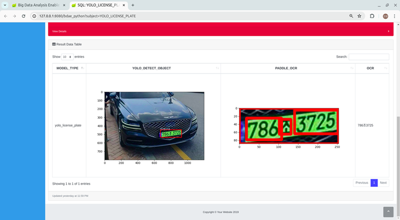

## ✅<span style="color:#034299">About BDAE(Big Data Analysis Enabler, AI Enabler) for Oracle Database</span>

***Big Data Analysis Enabler(BDAE)*** enables parallel processing of various AI-related R and Python modules without data movement based on Oracle Instance(s).
Because it implements the ***Oracle Data Cartridge Interface***, it is not limited to a specific schema and supports ***Dynamic SQL***.<br>
(contact : gracesjy@naver.com)<br>

***This*** is built on Oracle In-Database technology and has platform features that enable ***Oracle Database***
to be used not only as a simple storage for general AI tasks, but also as a non-stop operating environment
without the overhead of data movement during learning and inference.<br>


Below Image shows the operating location of BDAE in the form of Oracle In-Database.
Parallel distributed processing is a feature of Oracle In-Database, and analysts do not need to consider it in their modules, which increases the reusability of logic.
In addition, the fact that it can be integrated with various analysis engines can be seen as an advantage of BDAE. <br><br>


This can improve performance by reducing the number of DB calls while writing backend programs in Python and R.<br>
***Note)*** <br>
1.    ***BDAE*** was developed with inspiration from ***Oracle R Enterprise*** and was created solely using Oracle manuals.
      However, it took a lot of time to develop through trial and error due to the lack of examples.<br>
2.    ***BDAE*** enables your Python/R modules to run with parallelism like ***Oracle R Enterprise***. <br>
3.    But, ***BDAE*** has no alogithm unlike **Oracle R Enterprise**, just tool for AI (Machine Learning). <br>
      Algorithms are not included because they are constantly evolving and changing. This is also because analysts can do better. <br>
4.    Embedded Python/R execution provides some of the most significant advantages of using ***BDAE***. Using embedded Python/R execution, <br>
      you can store and run Python/R scripts in the database through either an Python/R interface or a SQL interface or both. <br>
      You can use the results of Python/R scripts in SQL-enabled tools for structured data, Python/R objects, and images.

## ***BDAE*** Table Functions
BDAE has special SQL statements related to Oracle In-Database and provides table functions for four types of analysis for Python and R respectively.<br>

1. apEval(SQL_args, SQL_output, PythonModuleName:start_function)
2. apTableEval(SQL_input, SQL_args, SQL_output, PythonModuleName:start_function)
3. apRowEval(SQL_input, SQL_args, SQL_output, No_of_Rows, PythonModuleName:start_function)
4. apGroupEval(SQL_input, SQL_args, SQL_output, GroupColumns, PythonModuleName:start_function)
5. asEval(SQL_args, SQL_output, R_script_name)
6. asTableEval(SQL_input, SQL_args, SQL_output, R_script_name)
7. asRowEval(SQL_input, SQL_args, SQL_output, No_of_Rows, R_script_name)
8. asGroupEval(SQL_input, SQL_args, SQL_output, GroupColumns, R_script_name)

apEval() is for simple testing without input data, while the rest all have input data. Each can be used for its own purpose, and the R and Python analysis modules are reusable. <br>
The most commonly used ones are apTableEval() and apGroupEval(), and the difference between the two is that apGroupEval has Group By built-in, allowing for parallel distributed processing. <br>

1. SQL_input : is a SQL statement describing the data to be analyzed and must be independently executed and queried.
2. SQL_args  : can represent hyperparameters or reference data for the analysis module. For example, hyperparameters can be expressed as follows: <br>
```
      select 0.000001 learning_rate, 100 epochs from dual
```
3. SQL_output : is the part where you enter the SQL statement for output or the View or Table name, and the type and number of columns must match the data.frame or pandas DataFrame in the return part of the R or Python analysis module.

4. No_of_Rows : means that the SQL_input data is split into each defined number and the analysis module is called and executed.
5. R_script_name/PythonModuleName:start_function : is where you enter the names of the registered R and Python modules you want to analyze. They are all managed in separate tables, and unlike R, Python is slightly different in the parts where you write the module name and the function name to start execution.
6. GroupColumns : applies only to apGroupEval() and is equivalent to inserting Group By in a SQL statement into the apTableEval() function. In other words, apGroupEval() defines that parallel distributed processing is performed based on these columns, and each column name can be written as col1, col2, col3, .. Therefore, analysts do not need to consider parallel distributed processing.


## ✅<span style="color:#034299">How To run (3 Steps to Run !)</span>
1. Register your Python/R model in the designated Oracle Database's table or save file in PYTHONPATH directory.
2. Register the SQL to bind source data and your model.
3. Run the SQL and get the results.  you can get results any tools capable of connecting Oracle Database.
***Note*** Using BDAE Web, you can simply and easily register Python/R and SQLs with Editor. (just copy & paste from Jupyter Notebook or Something)

### Step-1) Make Your Python module (ML/DL/ ...)

You must make entry function of module, for example describe().
others are helper functions. 

```
import numpy as np
import os
import matplotlib as mpl
import matplotlib.pyplot as plt
import pandas as pd
import tempfile
import base64
from pandas.plotting import scatter_matrix

def make_output(df, key, data):
   df[key] = data
   return df

def image_to_html():
   tmp_file_name = tempfile.NamedTemporaryFile().name + '.png'
   plt.savefig(tmp_file_name)
   image = open(tmp_file_name, 'rb')
   image_read = image.read()
   image_64_encode = base64.b64encode(image_read)
   uri = ''
   html_str = "<html><body>" + uri + "</body></html>"
   if os.path.exists(tmp_file_name):
      os.remove(tmp_file_name)
   return html_str

# start function : df_house supplied by BDAE automatically.
def describe(df_housing):
   # 0) Prepare Output
   tupleStart = {'subject': [ 'General ML' ] }
   pdf = pd.DataFrame(tupleStart)

   # 1) Historam
   df_housing.hist(bins=50, figsize=(20,15))
   a = image_to_html()
   pdf = make_output(pdf, 'Histogram', a)

   # 2) Scatter Plot
   df_housing.plot(kind="scatter", x="LONGITUDE", y="LATITUDE", alpha=0.4,
             s=df_housing["POPULATION"]/100, label="POPULATION", figsize=(10,7),
             c="MEDIAN_HOUSE_VALUE", cmap=plt.get_cmap("jet"), colorbar=True,
             sharex=False)
   plt.legend()
   a = image_to_html()
   pdf = make_output(pdf, 'ScatterPlot', a)

   # 3) Scatter Matrix
   attributes = ["MEDIAN_HOUSE_VALUE", "MEDIAN_INCOME", "TOTAL_ROOMS",
              "HOUSING_MEDIAN_AGE"]
   scatter_matrix(housing[attributes], figsize=(12, 8))
   a = image_to_html()
   pdf = make_output(pdf, 'ScatterMatrix', a)
   
   return pdf
```

### Step-2) Make Your SQL to run

The input (Oracle Database's Table or View or Queries) is delivered 
pandas DataFrame format to your python entry point function,
and You must make the results into pandas DataFrame format !,
because of Oracle Database Query Results(RDBMS).

```
SELECT * 
      FROM table(apTableEval(
         	cursor(SELECT * FROM CAL_HOUSING),  -- Input Data (Driving Table)
         	NULL,  -- Secondary Input Data
            'SELECT CAST(''A'' AS VARCHAR2(40)) SUBJECT,  -- Output Format
                  TO_CLOB(NULL) H1, TO_CLOB(NULL) H2, TO_CLOB(NULL) H3 
             FROM DUAL',
           'CAL_HOUSING_EDM:describe'))  -- Python Module for calling
```

### Step-3) Run above SQL and get Results
Like General SQL Queries' results, BDAE's results are the same.
(Any Applications you can develope using SQLs)
<br>


---------------------------------------
## ✅<span style="color:#034299">Installation</span>

Oracle Database is provided as Docker, and installation of Python and R with Anaconda has also become very convenient.<br>
Therefore, BDAE installation is very quick and can be installed within 5 minutes.<br><br>
This Docker can be provided in Docker tar file format and can be imported to your computer using following method.<br><br>

If you have a GPU, you can enter --gpus all --ipc=host as shown below. Use --ipc=host when you are not sure of the memory limit.<br><br>
> docker load -i bdae_oracle.tar<br>
> docker run -d --init --hostname=ol8 --ipc=host --name oracle_bdae_gpu --gpus all 
   -p 1521:1521 -p 5500:5500 -p 8888:8888 oracle_bdae_19c:0.7.5  


Please send me the mail if you want to test. (gracesjy@naver.com)<br>

---------------------------------------
## ✅<span style="color:#034299">Summary Document(Manual)</span>
[Big Data Analysis Enabler Summary(Korean)](https://github.com/gracesjy/hp/blob/master/assets/BDAE_Manual_Ko.pdf)
[Big Data Analysis Enabler Summary(English)](https://github.com/gracesjy/hp/blob/master/assets/BDAE_Manual.pdf)
## ✅<span style="color:#034299">More Information</span>
[Big Data Analysis Enabler GitHub](https://github.com/gracesjy/bdae)

## ✅<span style="color:#034299">Where to use ..</span>
1. Improved and simplified Backend performance
Instead of the backend calling SQL statements to Oracle Database multiple times, BDAE is used to obtain the same result in a single SQL statement call.
2. Unlike BigQuery on GCP, you can create models and perform inferences by tuning data and deciding on algorithms yourself. ( Cons and Pros )
3. Freely create MS Office files in a format that matches the data from various tables in the Oracle Database.
4. There is no need to consider parallel distributed processing, and preprocessing fully utilizes Oracle Database to improve performance.
5. Python and R codes exist in the DB and can be applied immediately without your code modification.
6. Increase system efficiency by using GPU instead of CPU during analysis process.
7. Maximize the stability and performance of Oracle Database, focus solely on analysis itself, and eliminate complexity.


## ✅<span style="color:#034299">Examples</span>

### Example #1 (YOLO Aquarium Training)
Aquarium Object Detection Training <br>
Python Source (YOLOv8:train saved into BDAE PYSCRIPT Table)<br>
Train Data from Roboflow Aquarium, YOLO v8 model trained using NVIDIA GTX3060(12GB)
```
from ultralytics import YOLO
import pandas as pd
import numpy as np
import os
os.environ['KMP_DUPLICATE_LIB_OK']='TRUE'
os.environ['PYTHONIOENCODING']='UTF-8'
import logging, logging.handlers
import sys
import base64
from os import listdir
from os.path import isfile, join
from StreamToLogger import StreamToLogger
import logging, logging.handlers

# comment
file_loc = []

def yolo_callback(x):
    print("yolo callback called !")
    file_loc.append(str(x))


def image_to_html(filename):
    image = open(filename, 'rb')
    image_read = image.read()
    image_64_encode = base64.b64encode(image_read)
    uri = ''
    html_str = "<html><body>" + uri + "</body></html>"
    return html_str

def train(df_args):
    logger = logging.getLogger('AquaModelByYOLOv8:train')
    logger.setLevel(logging.DEBUG)
    
    socketHandler = logging.handlers.SocketHandler('localhost',
                    logging.handlers.DEFAULT_TCP_LOGGING_PORT)
    
    logger.addHandler(socketHandler)
    
    sys.stdout = StreamToLogger(logger,logging.INFO)
    sys.stderr = StreamToLogger(logger,logging.ERROR)
    
    print("----- Aqua Object Detection by YOLOv8 start ------")
    model = YOLO("yolov8n.pt")
    # result = model.train(data='/home/oracle/DeepLearning/Aquarium_Combined.v2-raw-1024.yolov8/data.yaml', epochs=10,patience=30,batch=16,imgsz=416)
    result = model.train(data=df_args['PATH'], epochs=10,patience=30,batch=16,imgsz=416)
    result_dir = str(result.save_dir)
    result_chart_data = []
    result_chart_name = []
    
    onlyfiles = [f for f in listdir(result_dir) if isfile(join(result_dir, f))]
    print(onlyfiles)

    for i in range(len(onlyfiles)):
        if onlyfiles[i].lower().endswith(('.png', '.jpg', '.jpeg')) == True:
            result_chart_name.append(onlyfiles[i])
            print('before open file : ' + result_dir + '/' + onlyfiles[i])
            result_chart_data.append(image_to_html(result_dir + '/' + onlyfiles[i]))
        
    #result.confusion_matrix.plot(normalize=True, save_dir='/tmp', names=(list(model.names.values())), on_plot=yolo_callback)
    #cm_chart_clob = image_to_html(file_loc[0])
    
    dictData = {'Chart Name': result_chart_name, 'Chart': result_chart_data }
    print("----- Aqua Object Detection by YOLOv8 end ------")
    pdf = pd.DataFrame(dictData)
    return pdf
```
***BDAE SQL for inference***<br>
```
SELECT *
FROM table(apEval(
   cursor(SELECT '/home/oracle/DeepLearning/Aquarium_Combined.v2-raw-1024.yolov8/data.yaml' PATH FROM dual),
   'SELECT CAST(NULL AS VARCHAR2(400)) CHART_NAME, TO_CLOB(NULL) CHART_DATA FROM dual',
   'YOLOv8:train'))
```


### Example #2 (YOLO Aquarium Inference)
Aquarium Object Detection Inference <br>
Python <br>
Serialized Model already saved into Oracle dedicated table(MODEL_SAVING_TBL), BLOB type,<br>
  so for inference, use this Model.
```
import numpy as np
import pandas as pd
import matplotlib
import gc
matplotlib.use('Agg') 
import matplotlib.pyplot as plt
from matplotlib import style
import os
import sys
import urllib
import base64
from ultralytics import YOLO
import cv2
import matplotlib.pyplot as plt
import os
import subprocess
import cv2
import sys
import urllib
import base64
import pandas as pd
import _pickle as cPickle
import tempfile
import logging
from StreamToLogger import StreamToLogger
import logging, logging.handlers
   
os.environ['PROTOCOL_BUFFERS_PYTHON_IMPLEMENTATION']='python'

def image_to_html():
    tmp_file_name = tempfile.NamedTemporaryFile().name + '.png'
    plt.savefig(tmp_file_name)
    image = open(tmp_file_name, 'rb')
    image_read = image.read()
    image_64_encode = base64.b64encode(image_read)
    uri = ''
    html_str = "<html><body>" + uri + "</body></html>"
    if os.path.exists(tmp_file_name):
        os.remove(tmp_file_name)
    return html_str

def make_output(df, key, data):
    df[key] = data
    return df

def predict_aqua(df_data, df_model):
    logger = logging.getLogger('YOLOv8:predict_aqua')
    logger.setLevel(logging.DEBUG)

    socketHandler = logging.handlers.SocketHandler('localhost',
                   logging.handlers.DEFAULT_TCP_LOGGING_PORT)
    
    logger.addHandler(socketHandler)
     
    sys.stdout = StreamToLogger(logger,logging.INFO)
    sys.stderr = StreamToLogger(logger,logging.ERROR)   
    
    print('--- columns ----'  + str(df_model.columns))
    print(str(df_model.head()))
    print(str(df_data.head()))
    
    model_binary = df_model['RAWDATA'][0]
    tmp_file_name = tempfile.NamedTemporaryFile().name + '.pt'
    print('file_name : ' + tmp_file_name)
    with open(tmp_file_name, "wb") as f:
        f.write(model_binary)
        f.close()
        
    print('before loading model')   
    model = YOLO(tmp_file_name)
    print('before test data location ....' )  
    source_data = df_data['DATA'][0]
    print('after test data location ....' + source_data )  
    results = model.predict(source=source_data, save=True)
    print('after prediction ...')
    base64_list = []
    filelist = []
    for result in results:
        filename = os.path.basename(result.path).split('/')[-1]
        fullpathfilename = os.getcwd() + '/' + result.save_dir + '/' + filename
        image = open(fullpathfilename, 'rb')
        image_read = image.read()
        image_64_encode = base64.b64encode(image_read)
        uri = ''
        total = "<html><body>" + uri + "</body></html>"
        base64_list.append(total)
        filelist.append(filename)

    print(str(filelist))
    tupleStart = {'file name': filelist, 'images': base64_list }
    pdf = pd.DataFrame(tupleStart)   
    return pdf

```

***BDAE SQL for inference***<br>
The trained Model already saved in the MODEL_SAVING_TBL, the inferece uses this.

```
SELECT *
FROM table(apTableEval(
   cursor(SELECT '/home/oracle/DeepLearning/Aquarium_Combined.v2-raw-1024.yolov8/test/images' AS DATA FROM dual),
   cursor(SELECT MODEL_NAME AS KEY, 
                 MODEL_DATA AS RAWDATA, 
                 APPLY_YN AS YN 
          FROM MODEL_SAVING_TBL
          WHERE MODEL_NAME='yolov8_aqua_model'),
   'SELECT CAST(NULL AS VARCHAR2(120)) FileName, TO_CLOB(NULL) Image FROM dual',
   'YOLOv8:predict_aqua'))
```
> Result


### Example #3 (YOLO License Plate OCR Inference)
License Plate OCR Inference<br>
Python Code<br>
2 Packages used, YOLO for Object Detection (Licese Plate location in the cars) + PaddleOCR <br>
Train Data from Roboflow cars, YOLO v8 model trained using NVIDIA GTX3060(12GB)
```
import numpy as np
import pandas as pd
import matplotlib
import gc
matplotlib.use('Agg') 
import matplotlib.pyplot as plt
from matplotlib import style
import os
import sys
import urllib
import base64
from ultralytics import YOLO
import cv2
import matplotlib.pyplot as plt
import os
import subprocess
import cv2
import os
os.environ['PROTOCOL_BUFFERS_PYTHON_IMPLEMENTATION']='python'
from paddleocr import PaddleOCR

def predict():
    os.chdir('/home/oracle/yolo')
    model = YOLO('/home/oracle/yolo/yolo_license_plate.pt')
    img = cv2.imread('/home/oracle/yolo/car_2.jpg')
    results = model.predict(img, save=False, conf=0.5)
    color1 = (155, 200, 230)
    img_crop = None
    for result in results:
        boxes = result.boxes.cpu().numpy()  # Get boxes on CPU in numpy format
        for box in boxes:
            r = box.xyxy[0].astype(int)
            class_id = int(box.cls[0])  # Get class ID
            class_name = model.names[class_id]  # Get class name using the class ID
            cv2.rectangle(img, r[:2], r[2:], (0, 255, 0), 2)  # Draw boxes on the image
            cv2.putText(img, class_name, (r[0], r[1]), 1, 2, color1, 2, cv2.LINE_AA)
            img_crop = img[r[:2], r[2:]].copy()
    plt.imshow(img)
    plt.savefig('/tmp/result.png')
    img_crop =  img[r[1]:r[3], r[0]:r[2]].copy()  
    ocr = PaddleOCR(lang="korean")
    result = ocr.ocr(img_crop, cls=False)
    ocr_result = result[0]
    license_x = ''
    for rectObj in ocr_result:
        for rect in rectObj:
            if isinstance(rect, list):
                pt1 = tuple([int(s) for s in rect[0]])
                pt2 = (int(rect[1][0]), int(rect[3][1]))
            if isinstance(rect, tuple):
                license_x = license_x + rect[0]
            
    image = open('/tmp/result.png', 'rb')
    image_read = image.read()
    image_64_encode = base64.b64encode(image_read)
    print(type(image_64_encode))

    uri = ''
    total = "<html><body>" + uri + "</body></html>"

    color1 = (155, 200, 230)
    list_data1 = [1]
    list_data2 = [2]
    list_data3 = [total]
    list_data4 = [license_x]
    #list_data4 = [license_x]
    datax ={'Estimate No. Clusters': list_data1, 'Homogeneity': list_data2, 'IMG' : list_data3, 'OCR': list_data4}
    pdf = pd.DataFrame(datax)
    return (pdf)
```
***BDAE SQL for inference***<br>
```
SELECT * 
      FROM table(apTableEval(
            cursor(SELECT '/home/oracle/Downloads/20240428_175815.jpg' AS DATA FROM dual),
            cursor(SELECT MODEL_NAME AS KEY, 
                          MODEL_DATA AS RAWDATA, 
                          APPLY_YN AS YN 
                   FROM MODEL_SAVING_TBL
                   WHERE MODEL_NAME='yolo_license_plate'
            'SELECT CAST(NULL AS VARCHAR2(40)) MODEL_TYPE, TO_CLOB(NULL) YOLO_Detect_Object, 
                     TO_CLOB(NULL) PADDLE_OCR,
                   CAST(NULL AS   VARCHAR2(40)) OCR FROM dual',
           'YOLOv8:predict_with_model'))
```
> Result


### More Examples' Snapshot
[Big Data Analysis Enabler GitHub](https://github.com/gracesjy/bdae)


### BDAE 를 만든 이유
AWS 의 SageMaker, GCP 의 AutoML 은 상업적으로 많이 쓰이고 있다. 이것들이 나오기 전부터 Hadoop 그리고 Oracle Database 는 9i 때 처음 BDAE 아키텍처의 기본 Library 들이 포함되었다.<br>
High Tech. 에서 Oracle Database 를 많이 사용한다.  특히 무정지 운영이나 개발자 개입이 없는 데이터의 이동, 정제 등이 가능하고 빠른 트랜잭션 및 병렬 처리 능력 등이 타 데이터베이스에 비할 수 없이 훌륭하다.<br>
Oracle Database 가 운영에 사용되는 데 추론을 위해서 그 많은 데이터를 Network 을 타고 분석서버에 가서 데이터를 메모리에 로딩을 한 뒤, 또 GPU 에 올린 후에 다시 결과를 Oracle Database 에 넣는 그러한 일을 없애기 위해서 BDAE 를 만들었다.<br>
BDAE 는 AWS SageMaker, GCP AutoML 과 다른 Concept 이며 적어도 분석가의 코드를 제품에 맞춰서 개발할 필요가 없다. 즉, 변형이 거의 없다는 의미이다.<br>
데이터의 이동이 없고, 즉시 Oracle Database 원본 데이터를 기반으로 SQL 문으로 추론하고 그 결과를 일반 SQL 처럼 받는 것이다.<br>
특별한 유지보수가 불필요하고, 오직 분석가만 필요하다. DBA 는 원본 데이터에 대한 Query 성능만을 튜닝할 수 있다. 그 외에는 전혀 관여할 수 없다. 이 부분은 일반적인 기술이 아니기 때문이다.<br>


##### Big Data Analysis Enabler is not registered as a trademark.
