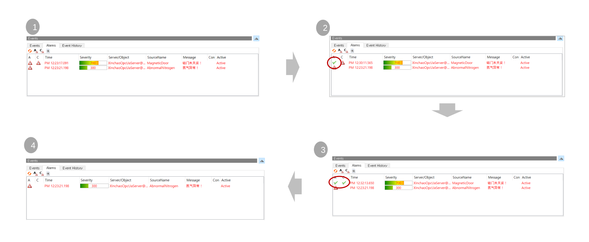
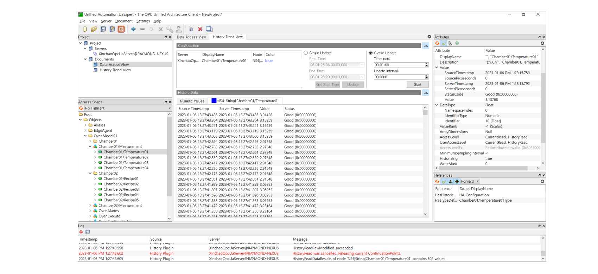

### ✅ SW Module Configuration

This product aims to be mounted in an Embedded BOX of the type below.
The Eclipse Milo OPC-UA (Java) project was initially used, and as detailed implementation of the Alarm/Event part was required, 
the commercial Prosys Java SDK was used.<br>
It uses its own framework based on Pure Java, and uses commercial products for the PLC communication part.<br>
(contact : gracesjy@naver.com)


### ✅ OPC-UA Built-In Embedded BOX
OPC-UA Server can have multi-session with equipment such as PLC and can communicate with products from most PLC companies. 
OPC-UA Manager is web-based and supports the OPC-UA protocol in the form of REST API.<br>
Once the PLC address map is provided, it can be immediately converted to XML and brought up to speed within an hour or two.<br>
It can also be tested by providing the image created with Docker, and can be started in the cloud if not via serial communication.


### ✅ Supported PLCs
The supported PLCs are as follows:

------------------------------------------------
1. Melsec – A1E, MC, Fx Serial, Fx Links, ..
2. Siemens – S7-S1200, 1500, S300, S400, S200, PPI, MPI, ..
3. Modbus – RTU,Ascii, TCP, ..
4. Inovance PLC
5. Omron – Fins TCP/UDP, HostLink,
6. LS – XGB Cnet (over TCP)
7. Yokogawa Plc
8. MQTT
9. OPC-DA based on Microsoft DCOM
10. Fanuc
11. Custom Socket
12. REST API
13. ...
<br>

### ✅ Address Space
An address space specifies the building blocks for exposing instances and type definitions.
When the OPC-UA server starts, it must perform address space configuration based on the defined environment file (opcua-map.xml).   
This configuration varies from device to device and can be configured by the manufacturer as needed and is not set in stone. 
Rather, it is necessary to classify and bind many parameters related to the device.


### ✅ Data Dictionary
Structures such as Recipe are defined separately and simplified. This part is a bit tricky because it connects with everything.


### ✅ Data Access
This function puts a lot of load on the BOX. This is because of real-time communication with the actual equipment, 
and the more the number called "Tag", the more load is given to the OS of the BOX.
(performance : 3,000 tags under 200ms with JAVA GC)


### ✅ Alarm and Conditions
As a OPC-UA Client, UaExpert 3 Tabs, Events (including ALARMs), ALARMs, Event History (including ALARMs History)



### ✅ Event/Alarm History
Using Event History Tab in UaExpert, You can see all alarms and events.   
OPC-UA servers contains this history in memory. (max limit : 10,000 - depends on configurations, and rotational memory management.)


### ✅ Historical Access



### ✅ OPC-UA Manager for REST API Client
OPC-UA Manager is provided for OPC-UA monitoring and configuration, and is based on Spring Boot + Vue.js, <br>
and has an OAth2 authentication system. <br> 
It provides a REST API and is intended for clients without an OPC-UA Stack.<br>
ie, Clients that do not have the OPC-UA module installed can access the facility using the REST API.<br>
It is a simple Python-based client as belows.

```
import sys
import requests
import json
import logging
import time


auth_server_url = "http://10.1.3.201:8080/api/oauth/token"
headers = {'authorization': 'Basic bXlBcHA6cGFzcw==', 'cache-control': 'no-cache', 
   'content-type' : 'application/x-www-form-urlencoded'}
token_req_payload = { 'grant_type': 'password', 'username': 'xxxxx', 
   'password': 'xxxxx' }

token_response = requests.post(auth_server_url, data=token_req_payload, verify=False, 
   allow_redirects=False, headers=headers)
print(token_response)

auth_token = token_response.json()['access_token']

' For Write Mode
headers = { 'Content-Type': 'application/json', 'Authorization' :  'Bearer ' +  auth_token }
write_body = {'nodeStr' : 'ns=3;s=Target100', 'value' : '999', 'custom' : 'false'}
data_url = 'http://10.1.3.201:8080/api/edge/opcua/write/data/value'
data_response = requests.post(data_url, data=json.dumps(write_body), headers=headers)
print(data_response)
print(data_response.json())

' For Read Mode
opcnodes = []
opcnodes.append({ 'nodeStr': 'ns=3;s=Target100'})
opcnodes.append({ 'nodeStr': 'ns=3;s=Target10'})
data_url = 'http://10.1.3.201:8080/api/edge/opcua/browse/data/multivalue'
data_response = requests.post(data_url, data=json.dumps(opcnodes), headers=headers)
print (data_response.json())
```

### ✅ OPC-UA, Monitoring using Grafana
Utilizing the datasource plugin framework, this projects allows you to access data from OPC UA servers directly from Grafana.


### ✅ Grafana + Telegraf + WS(WebSocket)
Grafana Plugin Build for OPC-UA, dotnet-sdk needed.
```
git clone https://github.com/grafana/opcua-datasource.git
sudo apt install dotnet-sdk-8.0 make
sudo apt-get install -y nodejs
curl -sS https://dl.yarnpkg.com/debian/pubkey.gpg | sudo apt-key add -
echo "deb https://dl.yarnpkg.com/debian/ stable main" | sudo tee /etc/apt/sources.list.d/yarn.list
sudo apt update && sudo apt install yarn
cd opcua-datasource
yarn install
yarn build
make build  # this is for gpx_opcua_linux_amd64
sudo apt install -y apt-transport-https software-properties-common wget
wget -q -O - https://packages.grafana.com/gpg.key | sudo apt-key add -
echo "deb https://packages.grafana.com/oss/deb stable main" | sudo tee /etc/apt/sources.list.d/grafana.list
sudo apt update && sudo apt install grafana
sudo systemctl daemon-reexec
sudo systemctl enable grafana-server
sudo systemctl start grafana-server

# edit grafana.ini
sudo vi /etc/grafana/grafana.ini
[plugins]
allow_loading_unsigned_plugins = grafana-opcua-datasource
..

sudo cp opcua-datasource /var/lib/grafana/plugins/grafana-opcua-datasource
```
### ✅ How to make Telegraf access to OPC-UA with WebSocket
First of all, you must get Token from Grafana Administrator > Users and access > Service accounts > Add service account. <br>
You must modify Telegraf.conf as followings, replaced Bear <your token> by your real token without <> characters.<br>
```
[[outputs.websocket]]
url = "ws://localhost:3000/api/live/push/opcua_stream"
data_format = "influx"
flush_interval = "1s"
[outputs.websocket.headers]
Authorization = "Bearer <your token>"
```

### ✅ Grafana session settings.
You must edit grafana.ini as followings, 7d means 7 days.
```
[auth]
login_maximum_inactive_lifetime_duration = 7d
login_maximum_lifetime_duration = 30d
token_rotation_interval_minutes = 1440
```
### ✅ Telegraf OPC-UA
First make key.pem, cert.pem files with openssl.
```
openssl genrsa -out key.pem 2048
openssl req -x509 -new -nodes -key key.pem -sha256 -days 365 -out cert.pem -subj "/C=KR/ST=Seoul/L=Seoul/O=MyCompany/CN=MyOPCUAClient"
```
edit telegraf.conf as followings. <br>
1) Basic256Sha256 Case

```
[[inputs.opcua]]
  name = "opcua"
  endpoint = "opc.tcp://172.22.128.1:52520/Xinchao/IOT"
  connect_timeout = "10s"
  request_timeout = "5s"
  security_policy = "Basic256Sha256"
  security_mode = "SignAndEncrypt"
  auth_method = "UserName"
  username = "admin"
  password = "glomis"
  certificate = "/etc/telegraf/cert.pem"
  private_key = "/etc/telegraf/key.pem"

  [[inputs.opcua.group]]
    name = "Temerature"
    namespace = "3"
    identifier_type = "s"
    nodes = [
      { name = "Siemens_I2Type", namespace = "3", identifier_type = "s", identifier = "Siemens_I2Type" }
    ]
```
2) Anonymous
```
[[inputs.opcua]]
  name = "opcua"
  endpoint = "opc.tcp://172.22.128.1:52520/Xinchao/IOT"
  connect_timeout = "10s"
  request_timeout = "5s"
  security_policy = "None"
  security_mode = "None"

  [[inputs.opcua.group]]
    name = "Temerature"
    namespace = "3"
    identifier_type = "s"
    nodes = [
      { name = "Siemens_I2Type", namespace = "3", identifier_type = "s", identifier = "Siemens_I2Type" }
    ]
```

### ✅ Python OPC-UA client
https://github.com/FreeOpcUa/python-opcua/tree/master/examples

```
from opcua import Client, ua

url = "opc.tcp://172.22.128.1:52520/Xinchao/IOT"
client = Client(url)

client.set_user("admin")
client.set_password("glomis")
client.set_security_string("Basic256Sha256,SignAndEncrypt,cert.pem,key.pem")
client.application_uri = "urn:example.org:FreeOpcUa:python-opcua"

client.connect()
print(f"Connected to: {url}")

servicelevel_node = client.get_node("ns=3;s=Siemens_I2Type")

servicelevel_node_value = servicelevel_node.get_value()
print(servicelevel_node_value)

servicelevel_node.set_value(ua.Variant(99, ua.VariantType.Int16))

client.disconnect()
```

### ✅ Influx Database(Version 2)
InfluxDB is a **time-series database (TSDB)**, an open-source database optimized for fast and efficient storage and retrieval of data over time. It is used for real-time data management in various fields, including operational monitoring, Internet of Things (IoT) sensor data, and application metrics. Its NoSQL-based, schemaless design makes it ideal for this purpose. <br>

Below is the simplest example and it is a query that can be thrown in Influx DB web or Grafana.


```
from(bucket: "mybucket")
  |> range(start: v.timeRangeStart, stop: v.timeRangeStop)
  |> filter(fn: (r) => r["_measurement"] == "opcua")
  |> filter(fn: (r) => r["_field"] == "AbsTemperature" or r["_field"] == "Temperature")
  |> aggregateWindow(every: v.windowPeriod, fn: mean, createEmpty: false)
  |> yield(name: "mean")
```
