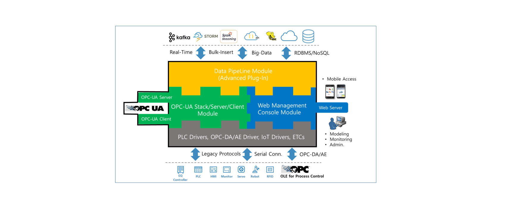
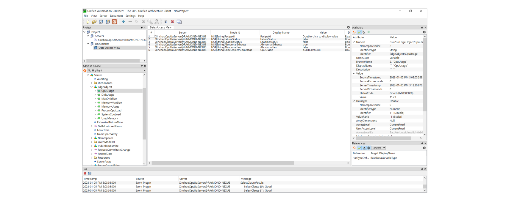

## SW Module Configuration

This product aims to be mounted in an Embedded BOX of the type below.
The Eclipse Milo OPC-UA project was initially used, and as detailed implementation of the Alarm/Event part was required, 
the commercial Prosys SDK was used.
(contact : gracesjy@naver.com)



## OPC-UA Built-In Embedded BOX
OPC-UA Server can have multi-session with equipment such as PLC and can communicate with products from most PLC companies. 
OPC-UA Manager is web-based and supports the OPC-UA protocol in the form of REST API.


<br>

## Address Space
An address space specifies the building blocks for exposing instances and type definitions.
When the OPC-UA server starts, it must perform address space configuration based on the defined environment file (opcua-map.xml).   
This configuration varies from device to device and can be configured by the manufacturer as needed and is not set in stone. 
Rather, it is necessary to classify and bind many parameters related to the device.


## Data Dictionary
Structures such as Recipe are defined separately and simplified. This part is a bit tricky because it connects with everything.


## Data Access
This function puts a lot of load on the BOX. This is because of real-time communication with the actual equipment, 
and the more the number called "Tag", the more load is given to the OS of the BOX.
(performance : 3,000 tags under 200ms with JAVA GC)



## Alarm and Conditions
As a OPC-UA Client, UaExpert 3 Tabs, Events (including ALARMs), ALARMs, Event History (including ALARMs History)


## Event/Alarm History
Using Event History Tab in UaExpert, You can see all alarms and events.   
OPC-UA servers contains this history in memory. (max limit : 10,000 - depends on configurations, and rotational memory management.)


## Historical Access


## OPC-UA Manager for REST API Client
Clients that do not have the OPC-UA module installed can access the facility using the REST API.<br>
It is a simple Python-based client as belows.

```
import sys
import requests
import json
import logging
import time


auth_server_url = "http://10.1.3.201:8080/api/oauth/token"
headers = {'authorization': 'Basic bXlBcHA6cGFzcw==', 'cache-control': 'no-cache', 
   'content-type' : 'application/x-www-form-urlencoded'}
token_req_payload = { 'grant_type': 'password', 'username': 'xxxxx', 
   'password': 'xxxxx' }

token_response = requests.post(auth_server_url, data=token_req_payload, verify=False, 
   allow_redirects=False, headers=headers)
print(token_response)

auth_token = token_response.json()['access_token']

' For Write Mode
headers = { 'Content-Type': 'application/json', 'Authorization' :  'Bearer ' +  auth_token }
write_body = {'nodeStr' : 'ns=3;s=Target100', 'value' : '999', 'custom' : 'false'}
data_url = 'http://10.1.3.201:8080/api/edge/opcua/write/data/value'
data_response = requests.post(data_url, data=json.dumps(write_body), headers=headers)
print(data_response)
print(data_response.json())

' For Read Mode
opcnodes = []
opcnodes.append({ 'nodeStr': 'ns=3;s=Target100'})
opcnodes.append({ 'nodeStr': 'ns=3;s=Target10'})
data_url = 'http://10.1.3.201:8080/api/edge/opcua/browse/data/multivalue'
data_response = requests.post(data_url, data=json.dumps(opcnodes), headers=headers)
print (data_response.json())
```


