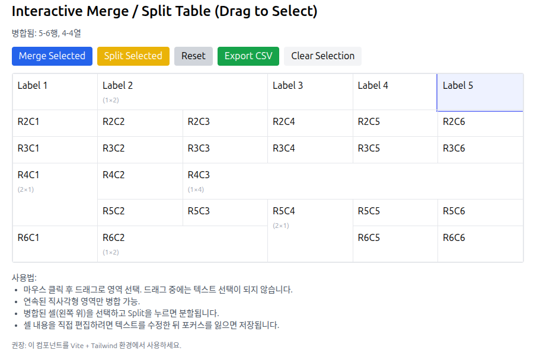

## ✅ 개요

PDF 문서에서 데이터를 추출하는데는 확실히 제한적이다.  특히 표 형태에서는 매우 취약하며 보안 관련 배경 문자열(Conferdential) 이
있을 경우에는 정말 엉망진창의 추출이 된다. <br>

반면 MS Word 문서가 만약 서식이 지켜지는 방식으로 작성되었다면 이를 Reverse 해서 데이터를 추출하기 매우 용이하며,
또한 DB 를 통해서 MS Word 문서를 서식에 의해 만들고 이를 PDF 포맷이나 HTML, Mark Down 형태로 만드는 것은 거의 완벽하다.
<br>
표에 관해서는 MS Word 를 가지고 만들 때 사용하는 Merge, 줄 맞춤 등을 코드화 하여 생성하거나, 이미 되어 있는 경우에도 거의 완벽하게 각 셀에
대한 원본 데이터 추출이 가능하다.<br>

특히 기본적인 Template Word 문서가 제공되었을 때, 우리는 Python 상용 패키지인 Spire-Doc 을 가지고 문서를 생성할 수 있고
복잡현 표의 형태도 자유롭게 Python 으로 손쉽게 만들 수 있다.

이때 BDAE (Big Data Aanlysis Enabler) 를 사용한다면 백앤드는 이 SQL 문만 호출하면 되기 때문에 매우 효과적이라고 할 수 있다.
특히 복잡한 형태의 표가 섞여 있는 경우 효과적이며 체계적이라고 볼 수 있다.<br>


## ✅ Using BDAE
아래 BDAE SQL 문을 살펴 보면 먼저 MS Word 템플릿을 지정하고, Python 에서 만들어 낼 여러 테이블의 Where 절에 해당 되는 값들을
넘겨 주는 두 번째 cursor 를 만든다. 리턴 포맷은 MS-WORD, HTML, PDF 등으로 설정할 수 있고 가장 중요한 Python 모듈과 함수를 지정하면 된다.<br>
이 SQL 문을 호출하면 MS-WORD, PDF 는 BLOB 형태로 넘어 오며, HTML, MARKDOWN 의 경우는 CLOB 형태로 SQL 결과를 받게 된다.
```
SELECT * FROM table(apTableEval(
    cursor(SELECT * FROM WordTemplateDB WHERE ID = 'MOSTemplate' AND VERSION='1.1.0'), --
    cursor(SELECT 'PRD_01' AS PRODUCT_ID, 'RECIPE_01' AS RECIPE_ID, .. FROM dual),
    'MS-WORD',
    'WORD_GEN_01:start'
))
```

## ✅ 테이블 구조

필요한 테이블들의 설계는 비지니스 모델에 따라 다르지만, 테이블이 비정형인 것을 먼저 감안해서 설계를 해야겠다.

1. Matrix 테이블

본 테이블은 간단하게 정규화 하지 않은 모습이며 특히 JOIN_TABLE 과 JOIN_WHERE 는 정규화 해야 하면 복잡할 수 있다.<br>
컬럼 구조 : KEY, ROW, COL, DEFAULT_LABEL, MERGE, JOIN_TABLE, JOIN_WHERE_CLAUSE, CSS <br>

|KEY|ROW|COL|DEFAULT_LABEL|MERGE_DIRECTION|JOIN_TABLE|JOIN_WHERE|CSS|
|--|--|--|--|--|--|--|--|
|7.1 |1 |1 |Label1|  |  |  |  |
|7.1 |1 |2 |Label2|  |  |  |  |
|7.1 |1 |3 |Label3|H |  |  |  |
|7.1 |1 |4 |Label3|H |  |  |  |
|7.1 |2 |1 |VAL1  |V |  |  |  |
|7.1 |2 |2 |VAL2  |  |  |  |  |
|7.1 |2 |3 |VAL3  |  |  |  |  |
|7.1 |2 |4 |VAL4  |  |  |  |  |
|7.1 |3 |1 |VAL1  |V |  |  |  |
|7.1 |3 |2 |VAL2  |  |  |  |  |
|7.1 |3 |3 |VAL3  |  |  |  |  |
|7.1 |3 |4 |VAL4  |  |  |  |  |

기본적인 것은 먼저 위의 데이터를 기반으로 표를 만들고, MERGE_DIRECTION 을 가지고 병합을 하는 것이다.<br>

```
  for (row, col_start, col_end) in hm:
    HM(target_row_no+row, fixed_column+col_start, fixed_column+col_end)
    
  for (col,  row_start, row_end) in vm:
    VM(fixed_column+col, target_row_no+row_start,target_row_no+row_end
```        

## ✅ GUI

다음의 웹 화면을 간단하게 구성해 보면, 동적으로 Merge, Split 을 하고 이를 위의 테이블과 연계하도록 해 볼 수 있겠다.<br>
이 화면에서 MS Word 표의 스타일을 구성하고, 셀의 크기, 경계 등을 구성하면 MS Word 로 표를 만드는 것보다 빨리 만들 수 있을 것이다. <br>




## ✅ 후기
예전에 프로젝트를 할 때 이런 것들에 대한 프로토타입을 하였었다.  Report 툴은 Label 이 일정했을 때 가능하지만, 그 당시의 표는
비정형 표였으며, 상단 또는 좌측 라벨을 기준으로 레코드를 뿌리는 형태가 아니었다. 따라서 표의 셀(Cell) 에 대한 정보를 가지고 있어야 했다.
<br>
표를 만들 때 기준이 되는 테이블은 그 테이블의 구조 및 셀의 형식, 병합 셀 정보, 폰트 등의 정보와 매칭되는 여러개의 테이블과의 매핑 정보가
존재해야 할 것이다. <br>


