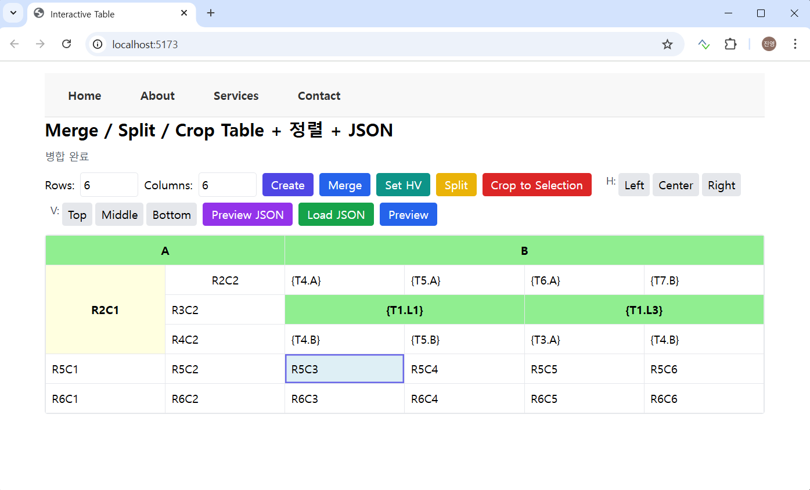
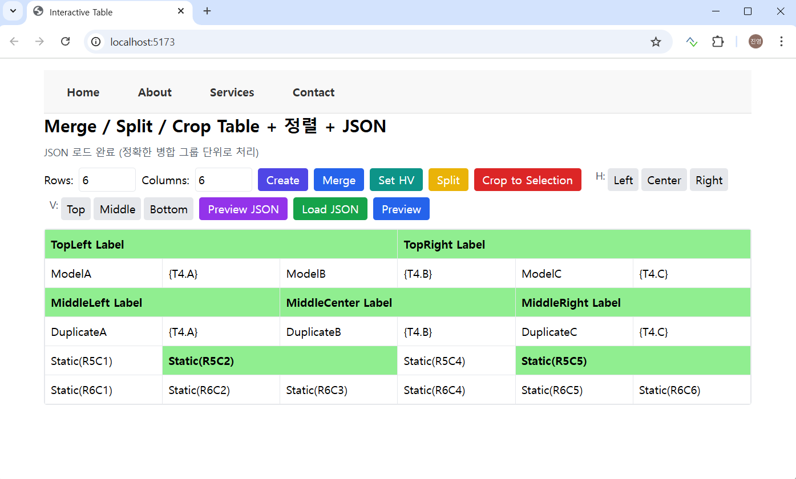
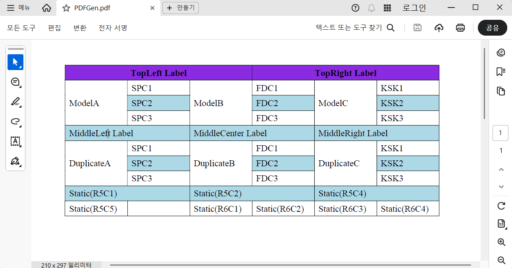
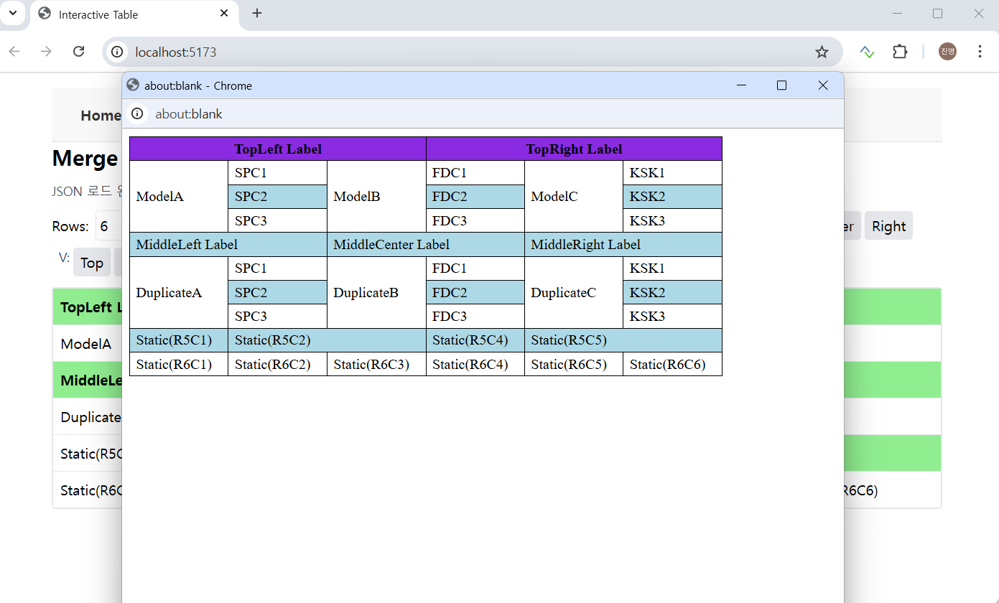

## ✅ 개요

MS Word 문서를 Generation 해야 하는 경우가 있다.  데이터베이스에 데이터가 있을 경우 그러하다.  
문제는 표이다.  일반적인 표의 작성을 이야기 하는 것은 아니다.  비정형 표에 대해서 이야기 하는 것이고,  
특히 엔지니어들이 심혈을 기울인 비정형표는 작성하기 쉽지가 않다.  
본 토픽은 표에 대한 병합에 대한 것이다.  기존 셀을 Split 하는 개념보다는 전체의 표의 Matrix 를 가지고 병합해 가는 방법이다.  

## ✅ Designer
이 소스는 Copilot 과 ChatGPT 의 도움을 받았다.   
Vue.js 는 프로젝트로 해 보았지만 React 는 처음이었다. 설명과 목적을 AI 에게 이야기 하니 AI 는 자연스럽게 React 소스를 처음 넘겨 주었고, 
하는 김에 React 를 배워서 해야 했는데 여기까지는 어렵지는 않았다. 
오히려 백엔드가 어려웠다. 그 부분은 데이터 설계와 관련이 있어서 AI 가 헷깔려 했고, 거의 도움을 받지 않았다.  

간단하게 수평, 수직 Merge 버튼이 있다.  폰트나 셀의 길이 등은 나중에 하기로 하고 지금의 목표는 병합이었고 스키마 설계와 외부 테이블들의 데이터를 효과적으로 셀에 넣기 위한 것이다.  
외부 테이블 데이터는 {TableName.columnName} 으로 넣으면 되고 현재에는 동일한 Context 로 해당 Row 들이 표에 수직의 경우 넣어진다.  

아래는 위의 디자인에 대한 최종 출력의 모습들이다.  여러가지 포맷으로 가능하다.  

## ✅ Sample

아래와 같이 React 웹으로 디자인 했다고 하면

JSON 데이터가 만들어지고 이를 DB 에 템플릿으로 저장하게 된다. 그리고 호출을 하면 외부 테이블의 해당 컬럼이 Expand 되면서 최종 문서가 만들어지게 된다. 
스키마 설계 때문에 중복된 외부 테이블 및 컬럼을 이곳 저곳에 넣어 보았다.  

## ✅ MS Word Generation
MS Word Generation 은 아래와 같이 되어진다. 위의 Design 과 상응하도록 되어 있다. 
본 백엔드는 FastAPI 로 되어 있으며 표의 병합 등은 Spire-Doc 을 이용한다.

## ✅ PDF Generation

Spire-Doc 으로 Generation 될 수 있으며 아래와 같다.

## ✅ HTML Preview

Spire-Doc 은 HTML 까지도 만들어 준다. 역시 병합, CSS 처리가 MS Word 와 동일하다.

## ✅ 후기
예전에 프로젝트를 할 때 이런 것들에 대한 제안을 한 적이 있었다. 프로토타입을 하였었다.  Report 툴은 Label 이 일정했을 때 가능하지만, 그 당시의 표는
비정형 표였으며, 상단 또는 좌측 라벨을 기준으로 레코드를 단순히 뿌리는 형태가 아니었다. 따라서 표의 셀(Cell) 에 대한 정보를 가지고 있어야 했다.
 
표를 만들 때 기준이 되는 테이블은 그 테이블의 구조 및 셀의 형식, 병합 셀 정보, 폰트 등의 정보와 매칭되는 여러개의 테이블과의 매핑 정보가 존재해야 할 것이다.  
이것의 핵심은 테이블 디자인이다.  이런 것들은 AI 하 하기가 어렵다. 아직까지는 ...  

