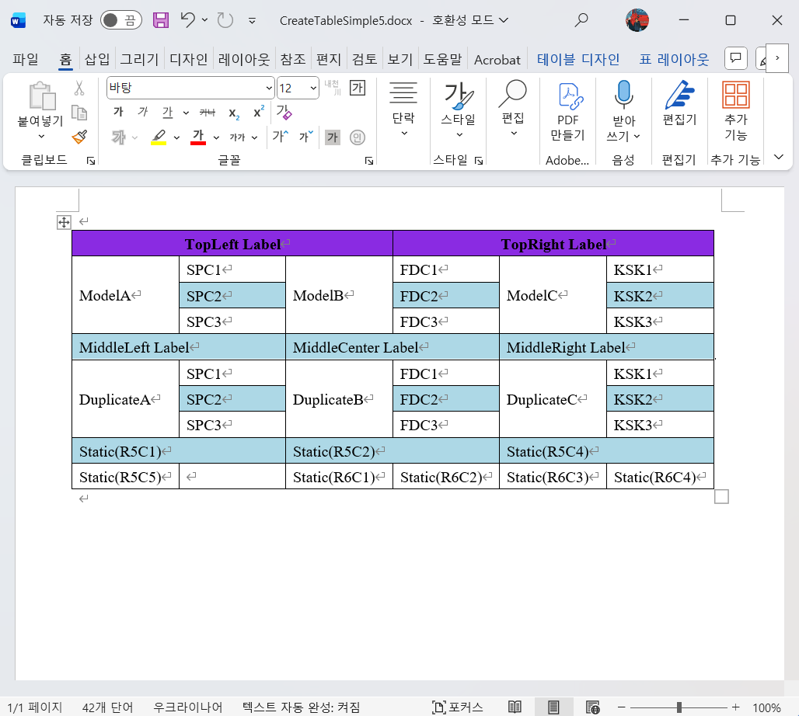

### ✅ Why ?

Sometimes you need to generate an MS Word document, especially if you have data in a database.
The problem is tables. I'm not talking about creating a typical table. I'm talking about unstructured tables.  
Especially, unstructured tables, which engineers have painstakingly crafted, are not easy to create. 
This topic is about merging tables. Rather than splitting existing cells, it's a method of merging the entire table matrix.

### ✅ Designer
This source code was developed with help from Copilot and ChatGPT.
I'd worked with Vue.js on projects before, but this was my first time with React. I explained the purpose and description to the AI, and it naturally handed me the React source code. 
While I was at it, I had to learn React, but up to this point, it wasn't difficult.
The backend was the real challenge. Because it involved data design, the AI ​​was confused and received little help.

There are simple horizontal and vertical Merge buttons. Fonts, cell lengths, and other details will be addressed later; the current goal is to merge data, effectively designing the schema and inserting data from external tables into cells.  
External table data can be entered as {TableName.columnName}, and currently, the corresponding rows are inserted into the table vertically within the same context.  
If the merge is in horizontal mode and the data is generated vertically, the "Set HV" button is used.  
 
Below are the final outputs for the above designs, available in various formats (.docx, .pdf, .html, .md).  

### ✅ Sample

If you design it with React Web as below,

JSON data is created and stored as a template in the database. When called, the corresponding columns in the external table are expanded to create the final document.  Due to the schema design, duplicate external tables and columns were inserted here and there.  

### ✅ MS Word Generation
MS Word Generation is as follows. It corresponds to the design above.  
This backend uses FastAPI, and Spire-Doc is used for table merging and other functions.

### ✅ PDF Generation

It can also be generated with Spire-Doc as follows:

### ✅ HTML Preview

Spire-Doc even generates HTML. Its merging and CSS processing are identical to MS Word's.

### ✅ Past memories..
I'd made suggestions and prototyped these ideas during a previous project. Reporting tools are feasible when labels are consistent, but the tables at the time were unstructured and weren't simply formatted to display records based on the top or left labels. Therefore, we needed to maintain information about the table's cells. 
When creating a table, the base table must have mapping information for multiple tables, including its structure, cell format, merged cell information, fonts, and other relevant information.  The key to this is ***table design***. This is difficult for AI to accomplish. As of yet...  

