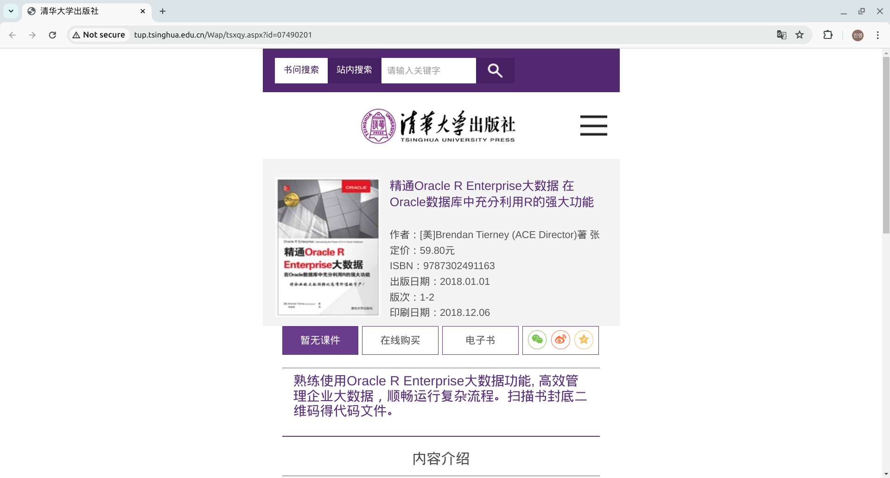
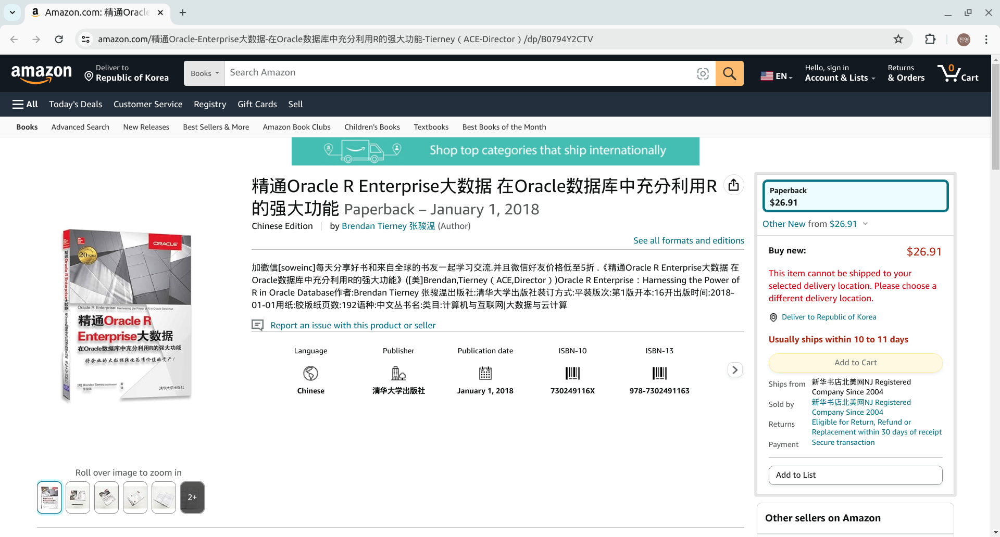
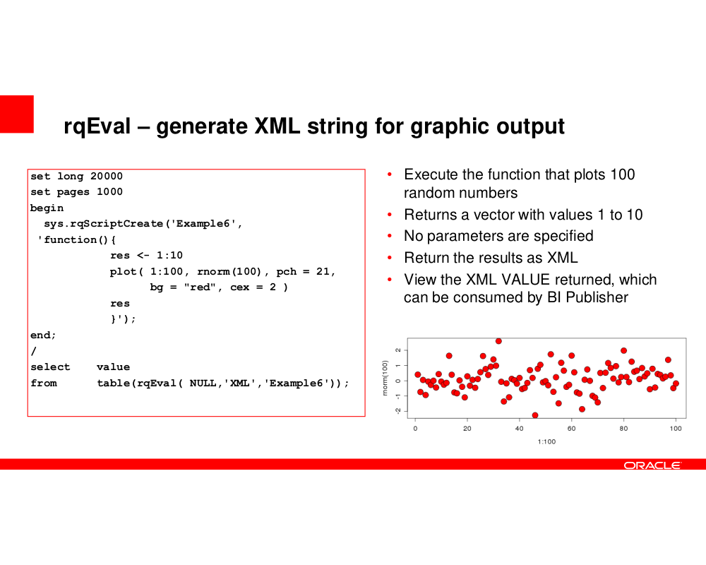
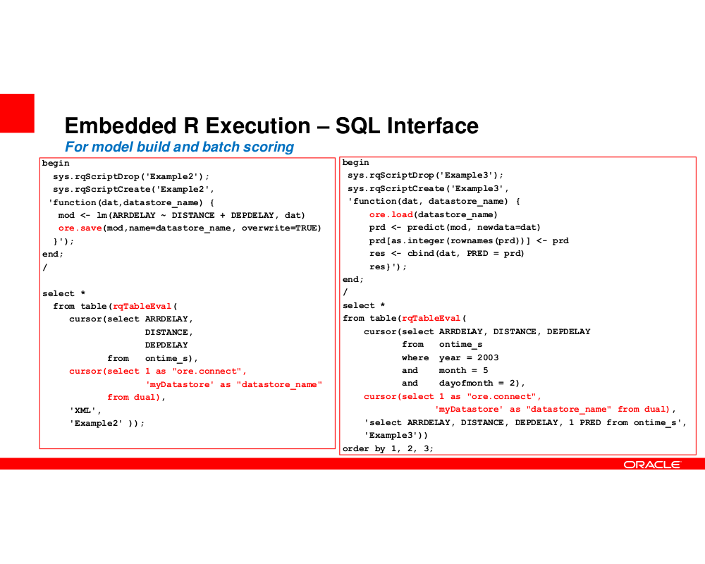
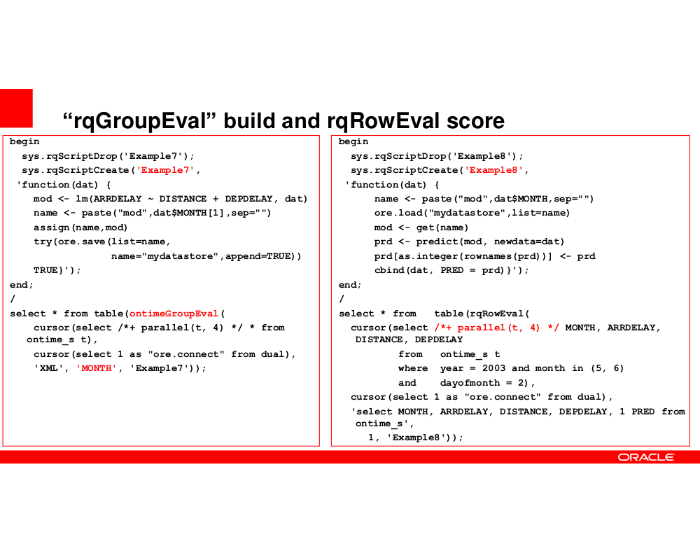

## <span style="color:blue">About BDAE ...</span>

<span style="color:blue">BDAE</span> 는
<span style="color:red">Oracle R Enterprise</style></span> 와 같이 <span style="color:blue">Oracle In-Database API</span> 를 사용했기 때문에 Oracle Database 와 관련 있는 <br>
<span style="color:blue">아키텍처는 동일하며</span>, 시스템 측면의 기본 설정 및 환경은 모두 동일하다. <br>

1) 분석 코드를 DB 에 등록 해서 사용한다.  이 분석 코드는 재활용된다.(Register Analysis Codes into DB)<br>
2) SQL 문으로 실행 결과를 실시간으로 확인한다. (Run SQL and see the results in Real-Time)<br>
3) 병렬 분산 처리를 수행한다.  이때 분석 코드는 관여하지 않고, Oracle Database 의 병렬 분산 처리를 이용한다.<br>
   (Use Oracle Parallelism.)

## <span style="color:red">Oracle R Enterprise </span>

매우 비싼 상용 분석 툴이며, 중국에서도 이 관련 서적을 찾아볼 수 있다.


```python
from IPython.display import Image
Image('/home/oracle/Pictures/ORE_China1.png')
```


    


```python
Image('/home/oracle/Pictures/ORE_China2.png')
```


    

    


```python
Image('/home/oracle/Pictures/ORE_rqEval.png')
```


    

    


```python
Image('/home/oracle/Pictures/ORE_rqTableEval.png')
```


    

    


```python
Image('/home/oracle/Pictures/ORE_rqGroupEval_rqRowEval.png')
```


    

    


## <span style="color:blue"> BDAE</span> and <span style="color:red">Oracle R Enterprise</span> are <span style="color:red">completely unrelated</span>.

<span style="color:red">Oracle R Enterprise</span>는 오픈 소스 R 을 사용하지 않고, <span style="color:red">Oracle R Distribution</span>을 사용한다.<br>
BDAE 는 Python, R 모두 된다.

### <span style="color:blue"> 1. Nan, Infinity </span>

분석에서는 매우 기본적인 것이지만, Oracle API 와 연계에서는 주의해야 할 부분이며 까다롭다.<br>


```python
import plotly.express as px
import matplotlib.pyplot as plt
import plotly.offline as py
import pandas as pd
import os
import tempfile
import numpy as np
import plotly.graph_objects as go
```


```python
import pandas as pd
import numpy as np

def returnNAN():
    df = pd.DataFrame([['motor type',1, np.inf],
                      [np.nan, 2, 3.2],
                      ['RF', np.nan, 4.5]],
                      columns = list('abc'))
    return df
```


```python
df = returnNAN()
df
```


<div>
<style scoped>
    .dataframe tbody tr th:only-of-type {
        vertical-align: middle;
    }

    .dataframe tbody tr th {
        vertical-align: top;
    }

    .dataframe thead th {
        text-align: right;
    }
</style>
<table border="1" class="dataframe">
  <thead>
    <tr style="text-align: right;">
      <th></th>
      <th>a</th>
      <th>b</th>
      <th>c</th>
    </tr>
  </thead>
  <tbody>
    <tr>
      <th>0</th>
      <td>motor type</td>
      <td>1.0</td>
      <td>inf</td>
    </tr>
    <tr>
      <th>1</th>
      <td>NaN</td>
      <td>2.0</td>
      <td>3.2</td>
    </tr>
    <tr>
      <th>2</th>
      <td>RF</td>
      <td>NaN</td>
      <td>4.5</td>
    </tr>
  </tbody>
</table>
</div>


### <span style="color:blue"> 2.Pandas to json </span>

분석의 중간, 중간에 데이터들이 많고, 특히 Inference 가 아니고 train 을 배치 작업을 할 때는 <br>
결국 분석가들은 차트, 데이터, 모델 등을 보고 싶어 할 것이다.  따라서 이 부분도 필요하다. <br>


```python
import json
import pandas as pd
import numpy as np

dictData = {'name': ['Raymond','James', 'Alex'], 'data': [123, 233, 23] }
df = pd.DataFrame(dictData)
df.to_json(orient='records')
```


    '[{"name":"Raymond","data":123},{"name":"James","data":233},{"name":"Alex","data":23}]'


### <span style="color:blue"> 3. Return Various Data Type </span>

분석은 간단하지 않기 때문에, 특히 Training 을 BDAE 로 할 때 다양한 데이터 타입을 리턴할 수 
있어야 한다.

그 목적에서 한번 만들어 본 것이다.


```python
def make_output(df, key, data):
   df[key] = data
   return df

def image_to_html():
   tmp_file_name = tempfile.NamedTemporaryFile().name + '.png'
   plt.savefig(tmp_file_name)
   image = open(tmp_file_name, 'rb')
   image_read = image.read()
   image_64_encode = base64.b64encode(image_read)
   uri = ''
   html_str = "<html><body>" + uri + "</body></html>"
   if os.path.exists(tmp_file_name):
      os.remove(tmp_file_name)
   return html_str
```


```python
def get_binary_data(filename):
   f = open(filename, mode="rb")
   data = f.read()
   return data
```


```python
def fillup():
    key_name = []
    varchar_data = []
    clob_data = []
    blob_data = []
    int_data = []
    double_data = []

    # varchar data
    sample = ['EQP01','EQP02','EQP03']
    for i in range(len(sample)):
        key_name.append('varchar_data_01')
        varchar_data.append(sample[i])
        clob_data.append(np.nan)
        blob_data.append(np.nan)
        int_data.append(np.nan)
        double_data.append(np.nan)

    # clob_data like image or something
    df = px.data.iris()
    fig = px.scatter_matrix(df, dimensions=["sepal_width", "sepal_length", "petal_width", "petal_length"], color="species")
    chartData = py.offline.plot(fig, output_type='div')

    key_name.append('Scatter Matrix')
    varchar_data.append(np.nan)
    clob_data.append(chartData)
    blob_data.append(np.nan)
    int_data.append(np.nan)
    double_data.append(np.nan)

    # clob for ML/DL results set to json
    dictData = {'keyname': ['avg fit time','avg score time', 'avg test time'], 'data': [0.047434, 0.015755, 0.955079] }
    mlResult = pd.DataFrame(dictData)
    mlResultJson = mlResult.to_json(orient='records')

    key_name.append('Ensenble')
    varchar_data.append(np.nan)
    clob_data.append(mlResultJson)
    blob_data.append(np.nan)
    int_data.append(np.nan)
    double_data.append(np.nan)

    # int data
    sample_integer = [1,2,3]
    for i in range(len(sample_integer)):
        key_name.append('int_data_01')
        varchar_data.append(np.nan)
        clob_data.append(np.nan)
        blob_data.append(np.nan)
        int_data.append(sample_integer[i])
        double_data.append(np.nan)

    # BLOB model
    f = open('/home/oracle/Pictures/ModeLSerialized.png', mode="rb")
    model_data = f.read()
    key_name.append('model_data_01')
    varchar_data.append(np.nan)
    clob_data.append(np.nan)
    blob_data.append(model_data)
    int_data.append(sample_integer[i])
    double_data.append(np.nan)

    dictData = {'Key': key_name, 'VARCHAR_DATA': varchar_data, 'CLOB_DATA': clob_data, 'BLOB_DATA': blob_data, 'INT_DATA': int_data, 'DOUBLE_DATA': double_data}
    pdf = pd.DataFrame(dictData)
    return pdf

```

#### <span style="color:blue">complex data type into one DataFrame

이것은 고정된 것이 아니라, 제언을 하는 것이다. <br>


```python
df = fillup()
df
```


<div>
<style scoped>
    .dataframe tbody tr th:only-of-type {
        vertical-align: middle;
    }

    .dataframe tbody tr th {
        vertical-align: top;
    }

    .dataframe thead th {
        text-align: right;
    }
</style>
<table border="1" class="dataframe">
  <thead>
    <tr style="text-align: right;">
      <th></th>
      <th>Key</th>
      <th>VARCHAR_DATA</th>
      <th>CLOB_DATA</th>
      <th>BLOB_DATA</th>
      <th>INT_DATA</th>
      <th>DOUBLE_DATA</th>
    </tr>
  </thead>
  <tbody>
    <tr>
      <th>0</th>
      <td>varchar_data_01</td>
      <td>EQP01</td>
      <td>NaN</td>
      <td>NaN</td>
      <td>NaN</td>
      <td>NaN</td>
    </tr>
    <tr>
      <th>1</th>
      <td>varchar_data_01</td>
      <td>EQP02</td>
      <td>NaN</td>
      <td>NaN</td>
      <td>NaN</td>
      <td>NaN</td>
    </tr>
    <tr>
      <th>2</th>
      <td>varchar_data_01</td>
      <td>EQP03</td>
      <td>NaN</td>
      <td>NaN</td>
      <td>NaN</td>
      <td>NaN</td>
    </tr>
    <tr>
      <th>3</th>
      <td>Scatter Matrix</td>
      <td>NaN</td>
      <td>&lt;div&gt;                        &lt;script type="tex...</td>
      <td>NaN</td>
      <td>NaN</td>
      <td>NaN</td>
    </tr>
    <tr>
      <th>4</th>
      <td>Ensenble</td>
      <td>NaN</td>
      <td>[{"keyname":"avg fit time","data":0.047434},{"...</td>
      <td>NaN</td>
      <td>NaN</td>
      <td>NaN</td>
    </tr>
    <tr>
      <th>5</th>
      <td>int_data_01</td>
      <td>NaN</td>
      <td>NaN</td>
      <td>NaN</td>
      <td>1.0</td>
      <td>NaN</td>
    </tr>
    <tr>
      <th>6</th>
      <td>int_data_01</td>
      <td>NaN</td>
      <td>NaN</td>
      <td>NaN</td>
      <td>2.0</td>
      <td>NaN</td>
    </tr>
    <tr>
      <th>7</th>
      <td>int_data_01</td>
      <td>NaN</td>
      <td>NaN</td>
      <td>NaN</td>
      <td>3.0</td>
      <td>NaN</td>
    </tr>
    <tr>
      <th>8</th>
      <td>model_data_01</td>
      <td>NaN</td>
      <td>NaN</td>
      <td>b'\x89PNG\r\n\x1a\n\x00\x00\x00\rIHDR\x00\x00\...</td>
      <td>3.0</td>
      <td>NaN</td>
    </tr>
  </tbody>
</table>
</div>


## <span style="color:blue">ETC (In case of Hive UDTF) </blue>

실제로 Big Data 관련 프로젝트, 개발, 운영 등은 모두 Hadoop 기반에서, Spark 기반에서 하였다.<br>
BDAE 도 Hive 기반, Spark 기반, maria db 기반으로도 만들어 보려고 했지만, Data Dictionary 등이<br>
Oracle 처럼 지원해 주지 못해서 매끄럽지는 못했다. <br>
이는 Hive Document 와 개발자들의 포럼에서 모두 확인했던 사항이다.

아래는 <span style="color:blue">Big Data Analysis Enabler for Hive 의 UDTF(User Defined Table Function)</span> 을 이용한 SQL 이다.<br>
그리고, 실제로 아래 SQL 은 프로젝트에서 사용되었다.


```
select bdaeAnalyzeC(j1.*,                                         'fab,eqp_id,start_dt,lot_id,recipe_id,cassette_slot,product_id,operation_id,lot_code,substrate_id,param_name1,param_value1',               'fab,eqp_id,start_dt,lot_id,recipe_id,cassette_slot,product_id,operation_id,lot_code,substrate_id,param_name1',
"select 1 no, 'atlas' jj, 2.3 pj", 'seaborn_plot')
from (
  select * from (
  select fab, eqp_id, start_dt, lot_id, recipe_id, cassette_slot, product_id, operation_id, lot_code, substrate_id,
         param_name1, param_value1
  from (
     select record_id, ts, lot_id, recipe_id, cassette_slot, product_id, operation_id, lot_code, substrate_id,
            param_name, param_value,zone, create_dtts, batch_id, batch_type, module_name,fab, eqp_id, start_dt

     from default.fdc_eqp_trace_ctcm
   ) k
   lateral view posexplode(param_name)EXPLODE_rec1 as seq1, param_name1
   lateral view posexplode(param_value)EXPLODE_rec2 as seq2, param_value1
where seq1 = seq2) t1
cluster by fab, eqp_id, start_dt, lot_id, recipe_id, cassette_slot, product_id, operation_id,
           lot_code, substrate_id, param_name1
) j1;
```


```python

```
