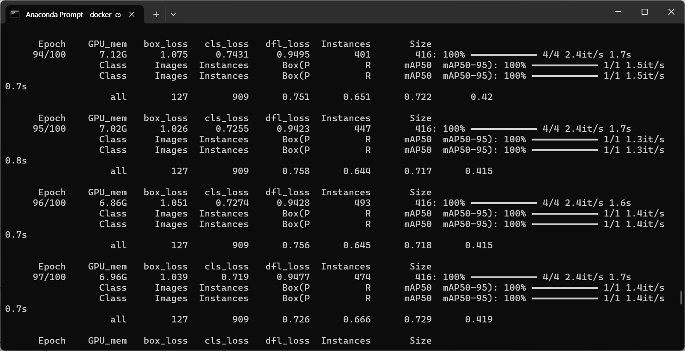

## ✅<span style="color:#034299">Using GPUs in Docker Containers</span>

When creating a Docker container, be sure to include --ipc=host . Otherwise, you will see an error during operation.
```
docker run -d --ipc=host --name oracle_bdae_gpu --gpus all -p 1521:1521 -p 5500:5500 -p 8888:8888 oracle_bdae:0.7
```

If you're not on Ubuntu, the following installation order is also important. The following works on Oracle Linux 8 and earlier.
```
conda activate <your_virtual_name>
pip install torch==2.6.0 torchvision==0.21.0 torchaudio==2.6.0 --index-url https://download.pytorch.org/whl/cu124
pip install tensorflow
pip install ultralytics (for example)
python
>>> import cv2 or ultralytics
...
ImportError: libGL.so.1: cannot open shared object file: No such file or directory
```

So, install ..
```
conda activate <your_virtual_name>
conda install fastai::opencv-python-headless
```

There is no need to install NVIDIA Driver (nvidia-smi commands ..) inside Docker Container.



