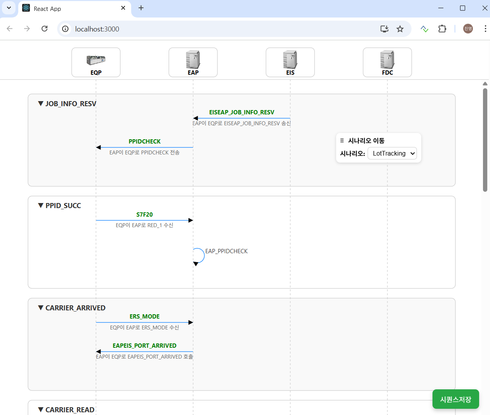

### ✅ With AI,

This is also true of UML, which is used in IT development, and sequence diagrams are particularly prevalent in manufacturing. This is likely because they facilitate visualizing the flow of data and messages across timelines between nodes. This was created using AI.

### ✅ Viewer
This source code was heavily aided by Copilot and ChatGPT. While I designed the data structure myself, it wasn't too difficult. Having previously implemented many things in Java and worked on Python and Vue.js projects, I was able to quickly implement it with a React frontend and a FastAPI backend. It took exactly two hours.  
Two SVGs are created, one for display. Since nodes shouldn't disappear when scrolling, they're configured as iframes. However, when displaying (saving), all nodes should appear simultaneously. 

### ✅ Enough !
In many cases, an Editor isn't necessary, as it can be extracted from JSON created for other purposes. Therefore, a Viewer is sufficient in these cases.
