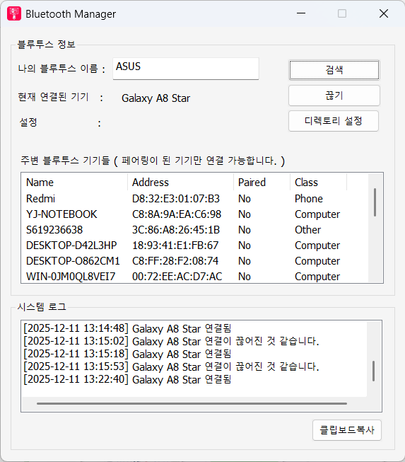
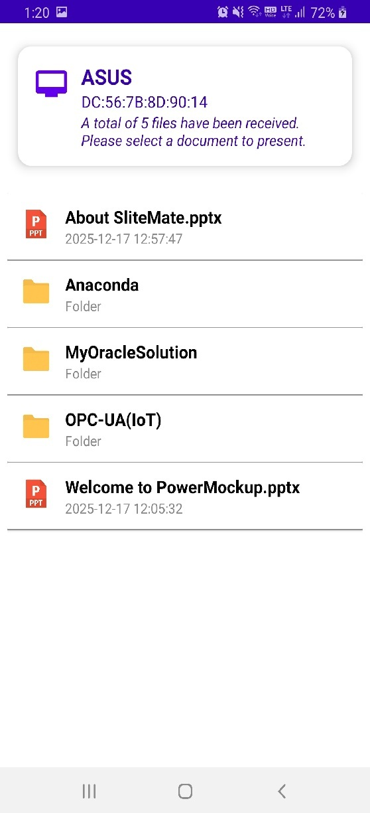
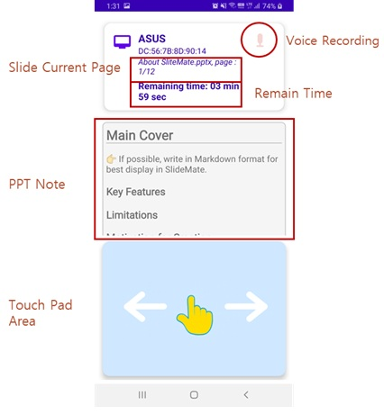

## SlideMate: Presentation Helper
This Android app helps you deliver PowerPoint presentations from your smartphone. The PC Manager and Android app communicate via Bluetooth, allowing you to open PowerPoint documents in specific folders, control the mouse, and navigate pages. This app has the inconvenience of installing PC Companion, which is unavoidable.

## PC Side Manager
"AOKY BT Manager", The PC-side Manager plays a practical role in pairing nearby Bluetooth devices and controlling PowerPoint. It also transmits the current document page and the presenter's annotations from the PowerPoint Add-In to the Android app.
   
Pairing your Android device with your PC can be done without using these apps, using the Bluetooth utility provided by Windows or Android. This makes setup easier.

## File Lists
When you connect to a registered PC via Bluetooth from the Android main screen, the directory and PowerPoint documents in the specified folder are displayed.

When you select a folder, it shows the usual form of showing the files and folders inside it again.

## Presentation Mode
Once you select a PowerPoint document to present, you'll enter presentation mode, and the file will automatically switch to slide mode. You can change the cursor to a laser pointer through the menu in the Android app.

Moving forward and backward on the page is implemented with gestures, so you can quickly scroll your hand to the right or left, and you can also use the sound volume.

## End of Presentation
When the presentation is over, pressing the back or close menu will automatically close the slide mode of the PowerPoint presentation, and the document will automatically close, causing PowerPoint to automatically exit.  
You will be taken back to the list of folders and document files.

## Download
For More, refer to below document. 
[Manual](https://github.com/gracesjy/hp/blob/master/Release/SlideMate_Simple_Manual.pdf)

### Android
[Android App Download](https://github.com/gracesjy/hp/blob/master/Release/app-slidemate.apk)
### PC (Windows 10/11)
[PC Companion Download](
https://github.com/gracesjy/hp/blob/master/Release/SliteMatePC_Companion/BluetoothManagerSetup.exe)
